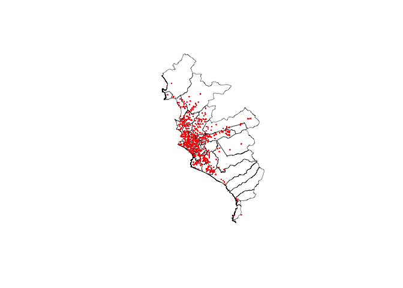
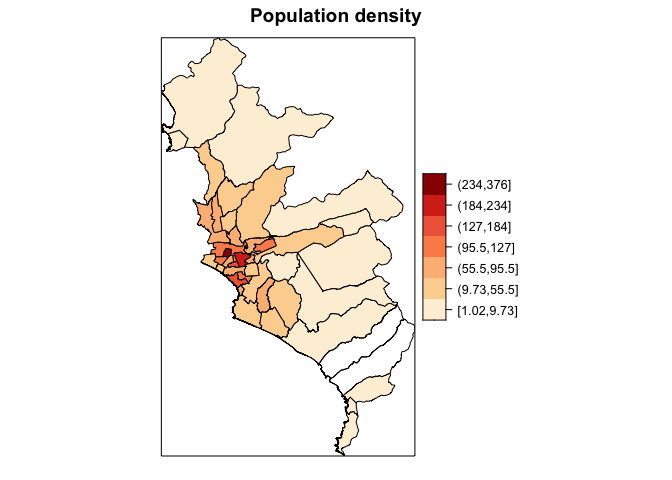
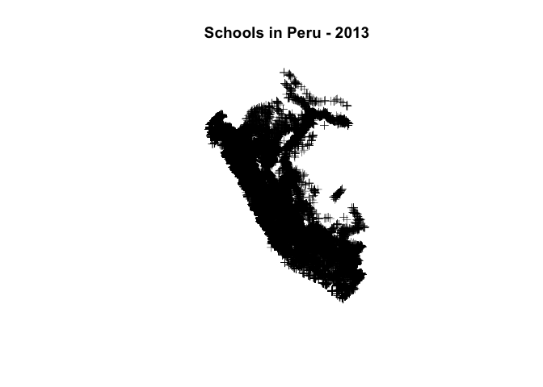
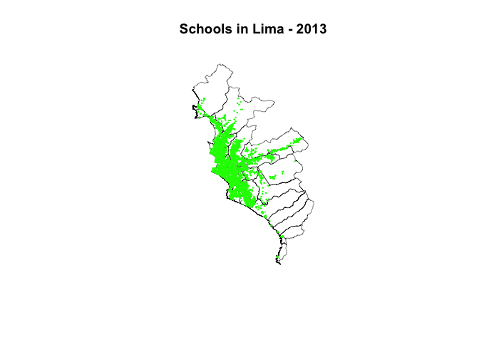

Very useful tools in R for Geospatial Analysis
================

In this document, I will explain some very useful and easy tools that I
use in R for geospatial analysis and for spatial object manipulation
(e.g shapefiles, raster files, spatial databases, etc.). I also going to
present some libraries and commands that I usually use in my-day-to-day
code work for cleaning and dataset manipulation (Stata alike)

For all this I’m going to use mainly examples of public databases from
the Peruvian context (the country that I come from). This is going to be
a very short post, but I’m going to try to include great variety of
tools at least for every basic analysis (e.g open spatial object, modify
them, plot maps, polygons, points, etc.)

``` r
  rm(list = ls()) # to clear your working spaces

  # These are the libraries that we are going to use for this small post
  
library(sp)
library(rgdal)
library(raster)
library(maptools)
library(rgeos)
  
  # For special graphs:
  
  library(ggplot2)
  library(tidyverse)
  library(broom)
  
  library(classInt) # for breaks graphs 
  library(RColorBrewer) # Color palette for maps 
  
  # For string
  library(stringr)
  
  # For databases 
  library(readstata13)
  library(dplyr)
  library(gdata)
```

## Level 0: Setup, open and inspect spatial object

Open shapefiles:

``` r
  mun <- readOGR(paste0("~/Dropbox/paulo_RA/Narcos/databases/municipios/update"), 
                        "BAS_LIM_DISTRITOS") # rgdal library
```

    ## OGR data source with driver: ESRI Shapefile 
    ## Source: "/Users/ptrifu/Dropbox/paulo_RA/Narcos/databases/municipios/update", layer: "BAS_LIM_DISTRITOS"
    ## with 1834 features
    ## It has 18 fields
    ## Integer64 fields read as strings:  Hectares

``` r
  # An easly inspect some objects:
  plot(mun)
```

<!-- -->

Of course, we are able not only to open a shp but even a latlong file
and transform it to a GIS kind of object. See for example:

``` r
  enaho <- read.dta13(paste0("~/Dropbox/BDatos/ENAHO/2020/737-Modulo01/",
    "enaho01-2020-100.dta")) # Kind of large dataset around 50k observations
```

    ## Warning in read.dta13(paste0("~/Dropbox/BDatos/ENAHO/2020/737-Modulo01/", : 
    ##   p113a:
    ##   Missing factor labels - no labels assigned.
    ##   Set option generate.factors=T to generate labels.

``` r
  # However we can easly handle this as an spatial object:
  
  coordinates(enaho) <- ~ longitud + latitud

  # A very important thing is to identify coords systm. For usual lat/long 
  # the following works:
  
  proj4string(enaho) <- CRS("+init=epsg:4326") # Here we are defining the coord syst.
    # sp library
  
  plot(enaho) # And we can plot it 
```

<!-- -->

Now we have in our R work enviroment two spatial objects, a polygon
object, Peruvian municipalities, and a point object, Peruvian household
for the Annual National Survey (ENAHO). Of course we can print this
together in a graph, but first we need to check if both spatial objects
have the same coords system

``` r
  print(crs(enaho))
```

    ## CRS arguments: +proj=longlat +datum=WGS84 +no_defs

``` r
  print(crs(mun)) ## crs from raster library
```

    ## CRS arguments:
    ##  +proj=utm +zone=18 +south +datum=WGS84 +units=m +no_defs

As you may see, the municipality dataset is in UTM coord system
(projected in meters), and the household survey is in standard latlong
coordinates. We can easily transform everything in UTM coords (it is
going to be useful later on) as follow:

``` r
  enaho <- spTransform(enaho, crs(mun))
  
  # And of course we can plot it together in a graph, and add one more 
  # shapeline of lines 
  
  # Rivers in Peru:
  
  rivers <- readOGR(paste0("~/Dropbox/BDatos/Shape/PER_wat"), 
                        "PER_water_areas_dcw") 
```

    ## OGR data source with driver: ESRI Shapefile 
    ## Source: "/Users/ptrifu/Dropbox/BDatos/Shape/PER_wat", layer: "PER_water_areas_dcw"
    ## with 890 features
    ## It has 5 fields

``` r
  rivers <- spTransform(rivers, crs(mun)) # just in case is in other crs 
  
  
  plot(mun, lwd = .1) # And we can plot it 
  plot(rivers, add = TRUE, border = "blue") # add lines
  plot(enaho, add = TRUE, col='red', pch=1, cex = .1) # add points 
```

<!-- -->

Of course these are not the most rad graphs, but they accomplish their
main purpose inspect the element. I will do another post with more
stylish figures ;)

## Level 1: Basic operations

We’ve already discussed the initial steps for any geographic analysis.
Now I am going to present some of the most basic operations that we can
perform on spatial objects. The good thing is that actually, we can do
everything that we used to do on a regular datasets (subsetting, math
operations, bysorts, conditionals, etc…)

``` r
  # Subsample
  mun <- mun[mun$NOMBPROV == 'LIMA',] # easily subsampling
  
  # Manipulating variables

  # We are going to create a dummy for the newest districts in Lima
  
  # But first, we need to do a little of cleaning, we can easily do this in R
  # even if it is an spatial object
  
  # Inspect the data
  
  sample_n(mun@data[,c("IDDIST", "NOMBDIST", "FECHA", "AREA_MINAM")], 15)
```

    ##    IDDIST                NOMBDIST        FECHA AREA_MINAM
    ## 1  150123              PACHACAMAC   EPOC.INDEP   18589.78
    ## 2  150143 VILLA MARIA DEL TRIUNFO   28/12/1961    6622.29
    ## 3  150114               LA MOLINA   06/02/1962    4873.98
    ## 4  150129             SAN BARTOLO   05/05/1946    5363.84
    ## 5  150106              CARABAYLLO EPOCA INDEP.   35727.58
    ## 6  150120       MAGDALENA DEL MAR   10/05/1920     326.58
    ## 7  150121         MAGDALENA VIEJA   EPOC.INDEP     464.52
    ## 8  150118              LURIGANCHO   EPOC.INDEP   24585.57
    ## 9  150112           INDEPENDENCIA   16/03/1964    1608.25
    ## 10 150138     SANTA MARIA DEL MAR   16/01/1962     775.33
    ## 11 150127             PUNTA NEGRA   07/04/1954   12965.18
    ## 12 150111             EL AGUSTINO   06/01/1965    1331.44
    ## 13 150125           PUENTE PIEDRA   14/02/1927    4904.72
    ## 14 150130               SAN BORJA   01/06/1983    1035.91
    ## 15 150136              SAN MIGUEL   10/05/1920     958.84

``` r
  # Substring last digits and convert tu numeric variable 
  
  mun$year_creation <- as.numeric(str_sub(mun$FECHA, -4))
```

    ## Warning: NAs introduced by coercion

``` r
  print(sum(is.na(mun$year_creation))) ## NA because raw variable
```

    ## [1] 7

``` r
  mun$year_creation[is.na(mun$year_creation)] <- 1821 # replace with correct value 
  
  print(sum(is.na(mun$year_creation))) ## Fixed
```

    ## [1] 0

``` r
  # Check it again:
  
  sample_n(mun@data[,c("IDDIST", "NOMBDIST", "year_creation", "AREA_MINAM")], 10)
```

    ##    IDDIST               NOMBDIST year_creation AREA_MINAM
    ## 1  150138    SANTA MARIA DEL MAR          1962     775.33
    ## 2  150130              SAN BORJA          1983    1035.91
    ## 3  150132 SAN JUAN DE LURIGANCHO          1967   14040.45
    ## 4  150123             PACHACAMAC          1821   18589.78
    ## 5  150103                    ATE          1821    8454.77
    ## 6  150124               PUCUSANA          1943    2908.31
    ## 7  150120      MAGDALENA DEL MAR          1920     326.58
    ## 8  150117             LOS OLIVOS          1989    1820.75
    ## 9  150135   SAN MARTIN DE PORRES          1950    3667.36
    ## 10 150116                  LINCE          1936     274.95

``` r
  # We can also easily summarize the year variable and any other:
  
  print(summary(mun$year_creation))
```

    ##    Min. 1st Qu.  Median    Mean 3rd Qu.    Max. 
    ##    1821    1874    1946    1922    1962    1989

``` r
  # Now we can create a dummy variable for the newest district, and plot them in a
  # map 
  
  mun$new_district <- ifelse(mun$year_creation>1980, 1, 0)
  
  # In more fancy way :) 
  
  plot(mun, col = "lightgrey",
       main = "Lima Municipalities")
  
  sel <- mun$new_district == 1 # regions with new districts for graph 
  
  plot(mun[ sel, ], col = "red", add = TRUE) # add selected zones to map
  legend("bottomright", title = "Year of creation",
         legend = c("After 1980s", "Before"),
         fill = c("red", "lightgrey"),
         cex = .7)
```

<!-- -->

``` r
  # We can rename variables and keep only a few vars:
  
  mun <- mun[, c("IDDIST", "NOMBDIST", "year_creation", 
                 "new_district", "AREA_MINAM")]
  
  # And rename the variable that we want: 
  
  mun <- rename.vars(mun, c("IDDIST", "NOMBDIST", "AREA_MINAM"), 
         c("ubigeo", "distrito", "area_mun")) 
```

    ## 
    ## Changing in mun                                
    ## From: IDDIST NOMBDIST AREA_MINAM
    ## To:   ubigeo distrito area_mun

``` r
  # And verified cleaned data:
  
  print(mun@data)
```

    ##     ubigeo                distrito year_creation new_district area_mun
    ## 738 150124                PUCUSANA          1943            0  2908.31
    ## 739 150138     SANTA MARIA DEL MAR          1962            0   775.33
    ## 749 150129             SAN BARTOLO          1946            0  5363.84
    ## 778 150127             PUNTA NEGRA          1954            0 12965.18
    ## 783 150142       VILLA EL SALVADOR          1983            1  3397.28
    ## 784 150126           PUNTA HERMOSA          1954            0 12194.62
    ## 786 150119                   LURIN          1857            0 18763.08
    ## 790 150108              CHORRILLOS          1857            0  3701.51
    ## 793 150104                BARRANCO          1874            0   274.85
    ## 795 150143 VILLA MARIA DEL TRIUNFO          1961            0  6622.29
    ## 796 150133  SAN JUAN DE MIRAFLORES          1965            0  2225.42
    ## 801 150122              MIRAFLORES          1857            0   914.88
    ## 804 150141               SURQUILLO          1949            0   462.90
    ## 810 150131              SAN ISIDRO          1931            0   970.02
    ## 811 150120       MAGDALENA DEL MAR          1920            0   326.58
    ## 813 150130               SAN BORJA          1983            1  1035.91
    ## 814 150116                   LINCE          1936            0   274.95
    ## 815 150140       SANTIAGO DE SURCO          1821            0  3455.92
    ## 818 150121         MAGDALENA VIEJA          1821            0   464.52
    ## 820 150113             JESUS MARIA          1963            0   434.33
    ## 823 150134                SAN LUIS          1968            0   348.74
    ## 824 150136              SAN MIGUEL          1920            0   958.84
    ## 826 150123              PACHACAMAC          1821            0 18589.78
    ## 828 150115             LA VICTORIA          1920            0   914.18
    ## 829 150114               LA MOLINA          1962            0  4873.98
    ## 831 150105                BRE\xd1A          1949            0   321.28
    ## 841 150101                    LIMA          1821            0  2142.82
    ## 843 150137             SANTA ANITA          1989            1  1067.91
    ## 845 150111             EL AGUSTINO          1965            0  1331.44
    ## 847 150109             CIENEGUILLA          1970            0 22497.01
    ## 849 150128                   RIMAC          1920            0  1212.11
    ## 851 150103                     ATE          1821            0  8454.77
    ## 858 150107              CHACLACAYO          1940            0  4266.05
    ## 859 150112           INDEPENDENCIA          1964            0  1608.25
    ## 866 150135    SAN MARTIN DE PORRES          1950            0  3667.36
    ## 871 150117              LOS OLIVOS          1989            1  1820.75
    ## 879 150110                   COMAS          1961            0  4875.15
    ## 884 150118              LURIGANCHO          1821            0 24585.57
    ## 888 150132  SAN JUAN DE LURIGANCHO          1967            0 14040.45
    ## 901 150125           PUENTE PIEDRA          1927            0  4904.72
    ## 910 150139              SANTA ROSA          1962            0  1746.31
    ## 932 150106              CARABAYLLO          1821            0 35727.58
    ## 946 150102                   ANCON          1874            0 32487.24

``` r
  print(typeof(mun)) # and we are still dealing with a spatial object 
```

    ## [1] "S4"

``` r
  # Other variables (but for our point spatial object)
  
  enaho$prov_id = substr(enaho$ubigeo,1,4) # creating an prov ID
  enaho$household_id = paste0(enaho$ubigeo, enaho$conglome, enaho$vivienda, 
                        enaho$hogar) # creating a household ID
  
  # We of course can quickly check what we did (in 10 random rows):
  
  sample_n(enaho@data[,c("ubigeo", "conglome", "vivienda", 
                         "hogar", "prov_id", "household_id")], 10) 
```

    ##    ubigeo conglome vivienda hogar prov_id      household_id
    ## 1  050109   005790      149    11    0501 05010900579014911
    ## 2  210301   019552      189    11    2103 21030101955218911
    ## 3  180303   008535      012    11    1803 18030300853501211
    ## 4  131203   007286      092    11    1312 13120300728609211
    ## 5  150137   007693      111    11    1501 15013700769311111
    ## 6  150605   008048      031    11    1506 15060500804803111
    ## 7  170101   008405      063    11    1701 17010100840506311
    ## 8  150101   007706      196    11    1501 15010100770619611
    ## 9  100307   006607      063    11    1003 10030700660706311
    ## 10 080605   006350      008    11    0806 08060500635000811

``` r
  # Notice the use of @data in the previous command, sometimes, we need to 
  # be more specific with R (but in most of the cases
  # we can treat spatial dataframe just as a regular dataframe
  
  # Our household ID is unique of course 
  print(length(enaho$household_id)) # Number of rows 
```

    ## [1] 53423

``` r
  print(length(unique(enaho$household_id))) # Number of unique rows 
```

    ## [1] 53423

``` r
  # We can check the number of municipalities and provinces too 
  
  print(length(unique(enaho$ubigeo)))
```

    ## [1] 1217

``` r
  print(length(unique(enaho$prov_id)))
```

    ## [1] 194

``` r
  # We are going to subsample our household database too, in order to match with 
  # the mun database 
  
  enaho <- enaho[enaho$prov_id == '1501',] # LIMA province
  
  # And we can check our subsampling:
  
  plot(mun, lwd = .5) # And we can plot it 
  plot(enaho, add = TRUE, col='red', pch=1, cex = .1) # add points
```

<!-- -->

And of course, as we can transform regular dataframes with lat/long to
spatial objects, we are able to turn them back to regular dataframes
(this can be useful in several cases, e.g when you would like to reduce
estimation time). Moreover, we can perform other more ‘complicated’ data
operations, like merge with other data information.

``` r
  enaho.df <- as.data.frame(enaho)
  
  # We are going to aggregate this data to merge it with our spatial database 
  
  enaho.ubigeo <- (enaho.df %>% group_by(ubigeo) %>% 
                 summarize(pob_mun = sum(factor07)))
```

    ## `summarise()` ungrouping output (override with `.groups` argument)

``` r
  # And do the merge:
  
  mun.enaho <- merge(mun, enaho.ubigeo)
  
  # And create relevant indicator such as population per 
  
  mun.enaho$density <- mun.enaho$pob_mun/mun.enaho$area_mun
  
  # And plot it (from sp library):
  
  # Figure with quantile breaks:
  
  # Here I make quantiles:
  
  pal <- brewer.pal(7, "OrRd") # we select 7 colors from the palette
  
  brks <- classIntervals(mun.enaho$density, 
                         n=7, style="jenks")$brks # breaks 
```

    ## Warning in classIntervals(mun.enaho$density, n = 7, style = "jenks"): var has
    ## missing values, omitted in finding classes

``` r
  # Categorical variable 
  mun.enaho$density_cat <- cut(mun.enaho$density, brks, 
                                include.lowest = TRUE, dig.lab=3)
  # plot
  spplot(mun.enaho, "density_cat", 
         col.regions=pal, main = "Population density")
```

<!-- -->

## Level 2: Spatial operations - spatial merge, aggregations, grid generation, and more

In this part we are going other spatial operations

``` r
  # For this new excercise, we are going to open a new database - School in 2013:

  schools <- read.dta13(paste0("~/Dropbox/BDatos/escuelas_2013.dta"))
  
  coordinates(schools) <- ~ Longitud + Latitud # transform it to spatial object
    # Note that there should no be any missing here 
  
  # defining coords:
  proj4string(schools) <- CRS("+init=epsg:4326") # standard coords
  
  plot(schools, col = "black", lwd = .5, main = "Schools in Peru - 2013")
```

<!-- -->

``` r
  print(length(schools)) # number of schools 
```

    ## [1] 78927

``` r
  print(sample_n(schools@data, 10)) # we don't have ubigeo variable here. 
```

    ##    cod_mod
    ## 1  1240779
    ## 2   704957
    ## 3  1212265
    ## 4   304196
    ## 5  1383801
    ## 6  1087790
    ## 7  1000058
    ## 8  1378330
    ## 9  1568237
    ## 10 1595347

``` r
  # So in order to select only Lima schools, we have to do an spatial merge
  # a merge base on the caracteristics 
  
  schools <- spTransform(schools, crs(mun.enaho)) # we need first to transform the coords
  schools.lima <- over(schools, mun.enaho)
  schools.lima <- spCbind(schools, schools.lima) # Here I recover the information 
  
  schools.lima <- schools.lima@data[complete.cases(schools.lima@data), ]
  
  plot(schools.lima)
```

<!-- -->
