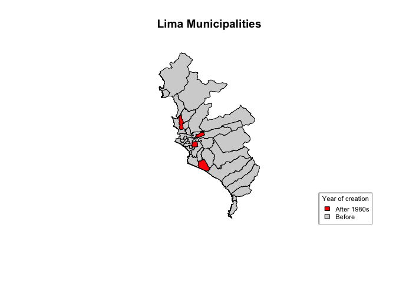

Very useful tools in R for Geospatial Analysis
================

In this document, I will explain some very useful and easy tools that I
use in R for geospatial analysis and for spatial object manipulation
(e.g shapefiles, raster files, spatial databases, etc.). I also going to
present some libraries and commands that I usually use in my-day-to-day
code work for cleaning and dataset manipulation (Stata alike)

For all this I’m going to use mainly examples of public databases from
the Peruvian context (the country that I come from). This is going to be
a very short post, but I’m going to try to include great variety of
tools at least for every basic analysis (e.g open spatial object, modify
them, plot maps, polygons, points, etc.)

## Level 0: Setup, open and inspect spatial object

Open shapefiles:

``` r
  mun <- readOGR(paste0("~/Dropbox/paulo_RA/Narcos/databases/municipios/update"), 
                        "BAS_LIM_DISTRITOS") # rgdal library
```

    ## OGR data source with driver: ESRI Shapefile 
    ## Source: "/Users/ptrifu/Dropbox/paulo_RA/Narcos/databases/municipios/update", layer: "BAS_LIM_DISTRITOS"
    ## with 1834 features
    ## It has 18 fields
    ## Integer64 fields read as strings:  Hectares

``` r
  # An easly inspect some objects:
  plot(mun)
```

<!-- -->

Of course, we are able not only to open a shp but even a latlong file
and transform it to a GIS kind of object. See for example:

``` r
  enaho <- read.dta13(paste0("~/Dropbox/BDatos/ENAHO/2020/737-Modulo01/",
    "enaho01-2020-100.dta")) # Kind of large dataset around 50k observations
```

    ## Warning in read.dta13(paste0("~/Dropbox/BDatos/ENAHO/2020/737-Modulo01/", : 
    ##   p113a:
    ##   Missing factor labels - no labels assigned.
    ##   Set option generate.factors=T to generate labels.

``` r
  # However we can easly handle this as an spatial object:
  
  coordinates(enaho) <- ~ longitud + latitud

  # A very important thing is to identify coords systm. For usual lat/long 
  # the following works:
  
  proj4string(enaho) <- CRS("+init=epsg:4326") # Here we are defining the coord syst.
    # sp library
  
  plot(enaho) # And we can plot it 
```

<!-- -->

Now we have in our R work enviroment two spatial objects, a polygon
object, Peruvian municipalities, and a point object, Peruvian household
for the Annual National Survey (ENAHO). Of course we can print this
together in a graph, but first we need to check if both spatial objects
have the same coords system

``` r
  print(crs(enaho))
```

    ## CRS arguments: +proj=longlat +datum=WGS84 +no_defs

``` r
  print(crs(mun)) ## crs from raster library
```

    ## CRS arguments:
    ##  +proj=utm +zone=18 +south +datum=WGS84 +units=m +no_defs

As you may see, the municipality dataset is in UTM coord system
(projected in meters), and the household survey is in standard latlong
coordinates. We can easily transform everything in UTM coords (it is
going to be useful later on) as follow:

``` r
  enaho <- spTransform(enaho, crs(mun))
  
  # And of course we can plot it together in a graph, and add one more 
  # shapeline of lines 
  
  # Rivers in Peru:
  
  rivers <- readOGR(paste0("~/Dropbox/BDatos/Shape/PER_wat"), 
                        "PER_water_areas_dcw") 
```

    ## OGR data source with driver: ESRI Shapefile 
    ## Source: "/Users/ptrifu/Dropbox/BDatos/Shape/PER_wat", layer: "PER_water_areas_dcw"
    ## with 890 features
    ## It has 5 fields

``` r
  rivers <- spTransform(rivers, crs(mun)) # just in case is in other crs 
  
  
  plot(mun, lwd = .1) # And we can plot it 
  plot(rivers, add = TRUE, border = "blue") # add lines
  plot(enaho, add = TRUE, col='red', pch=1, cex = .1) # add points 
```

<!-- -->

Of course these are not the most rad graphs, but they accomplish their
main purpose inspect the element. I will do another post with more
stylish figures ;)

## Level 1: Basic operations

We’ve already discussed the initial steps for any geographic analysis.
Now I am going to present some of the most basic operations that we can
perform on spatial objects. The good thing is that actually, we can do
everything that we used to do on a regular datasets (subsetting, math
operations, bysorts, conditionals, etc…)

``` r
  # Subsample
  mun <- mun[mun$NOMBPROV == 'LIMA',] # easily subsampling
  
  # Include example of dummy gen here and plot // --> to do
  
  # Manipulating variables
  enaho$prov_id = substr(enaho$ubigeo,1,4) # creating an prov ID
  enaho$household_id = paste0(enaho$ubigeo, enaho$conglome, enaho$vivienda, 
                        enaho$hogar) # creating a household ID
  
  # We of course can quickly check what we did (in 10 random rows):
  
  sample_n(enaho@data[,c("ubigeo", "conglome", "vivienda", 
                         "hogar", "prov_id", "household_id")], 10) 
```

    ##    ubigeo conglome vivienda hogar prov_id      household_id
    ## 1  170102   008447      015    11    1701 17010200844701511
    ## 2  110508   006796      132    11    1105 11050800679613211
    ## 3  051101   015923      172    11    0511 05110101592317211
    ## 4  040128   015710      004    11    0401 04012801571000411
    ## 5  100804   010116      030    11    1008 10080401011603011
    ## 6  110301   011339      057    11    1103 11030101133905711
    ## 7  010502   015041      007    11    0105 01050201504100711
    ## 8  170101   008409      057    11    1701 17010100840905711
    ## 9  200101   010303      085    11    2001 20010101030308511
    ## 10 200115   008759      002    11    2001 20011500875900211

``` r
  # Notice the use of @data in the previous command, sometimes, we need to 
  # be more specific with R (but in most of the cases
  # we can treat spatial dataframe just as a regular dataframe
  
  # Our household ID is unique of course 
  print(length(enaho$household_id)) # Number of rows 
```

    ## [1] 53423

``` r
  print(length(unique(enaho$household_id))) # Number of unique rows 
```

    ## [1] 53423

``` r
  # We can check the number of municipalities and provinces too 
  
  print(length(unique(enaho$ubigeo)))
```

    ## [1] 1217

``` r
  print(length(unique(enaho$prov_id)))
```

    ## [1] 194

``` r
  # We are going to subsample our household database too, in order to match with 
  # the mun database 
  
  enaho <- enaho[enaho$prov_id == '1501',] # LIMA province
  
  # And we can check our subsampling:
  
  plot(mun, lwd = .5) # And we can plot it 
  plot(enaho, add = TRUE, col='red', pch=1, cex = .1) # add points
```

<!-- -->

And of course, as we can transform regular dataframes with lat/long to
spatial objects, we are able to turnback them to regular dataframes
(this can be useful in several cases, e.g when you would like to reduce
estimation time). Moreover, we can perform other more ‘complicated’ data
operations, like merge with other data information.

## Level 2: Spatial operations - spatial merge, aggregations, grid generation, and more

## Level 3: Elevation and raster objects
